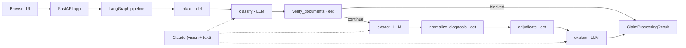
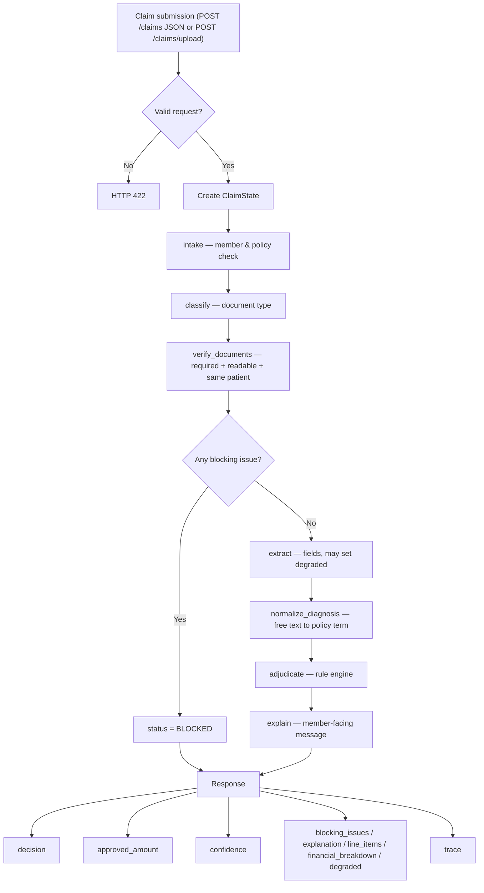
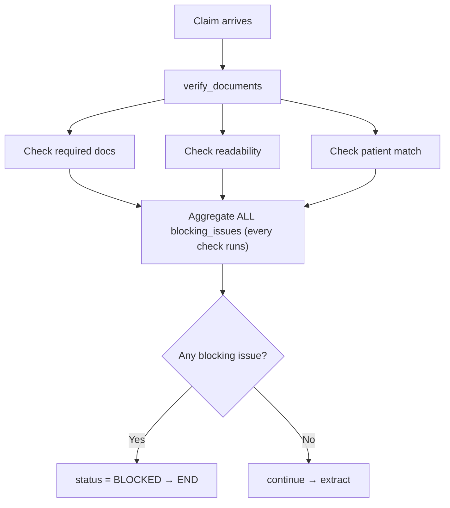
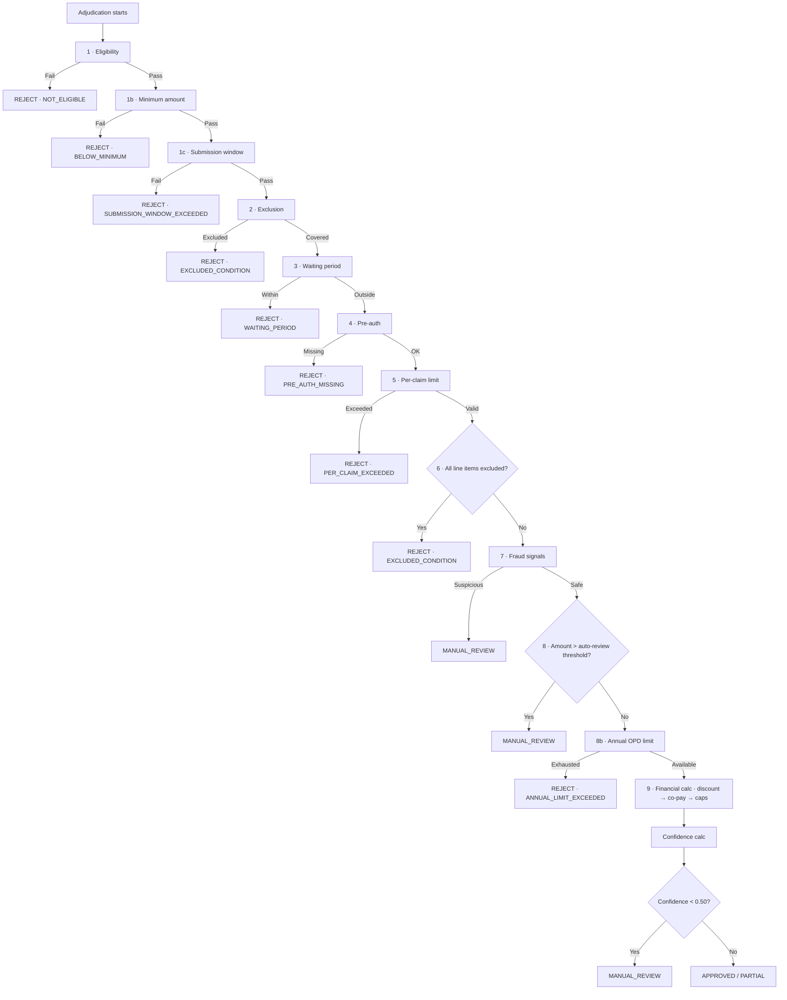
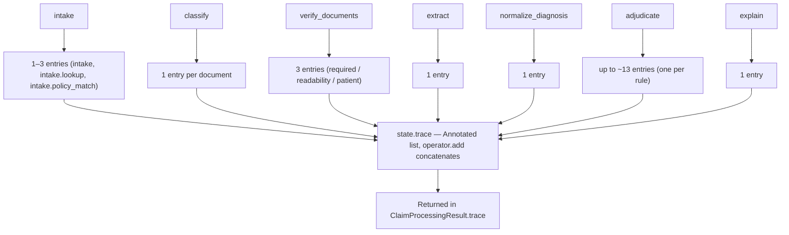

# Architecture — Health Insurance Claims Processing System

> **Status:** living document, kept in sync with the implementation.
> **Scope:** this is the master design document — problem, approach, decisions,
> tech stack, pipeline, flow, rule engine, observability, failure handling,
> scaling, risks, and the 12 test-case flows.
> **Companion:** [`TECHNICAL_DOCUMENTATION.md`](./TECHNICAL_DOCUMENTATION.md)
> is the file-by-file / phase-by-phase reference. This file is the *why* and
> the *shape*; that file is the *what's-in-each-file*.
>
> **Base files (never modified):** `assignment.md`, `policy_terms.json`,
> `README.md`, `sample_documents_guide.md`, `test_cases.json`. The system reads
> `policy_terms.json` at runtime; it is treated as read-only input.

---

## Table of contents

1. [Problem](#1-problem)
2. [Goals & non-negotiables](#2-goals--non-negotiables)
3. [Approach & guiding principles](#3-approach--guiding-principles)
4. [High-level architecture](#4-high-level-architecture)
5. [Tech stack & rationale](#5-tech-stack--rationale)
6. [The pipeline (nodes)](#6-the-pipeline-nodes)
7. [End-to-end flow](#7-end-to-end-flow)
8. [The deterministic rule engine](#8-the-deterministic-rule-engine)
9. [Financial computation order](#9-financial-computation-order)
10. [Confidence scoring](#10-confidence-scoring)
11. [Data model](#11-data-model)
12. [Observability & the trace](#12-observability--the-trace)
13. [Failure handling & graceful degradation](#13-failure-handling--graceful-degradation)
14. [Decision log](#14-decision-log)
15. [Risk register](#15-risk-register)
16. [Test-case routing map](#16-test-case-routing-map)
17. [Folder structure](#17-folder-structure)
18. [Scaling to 10x](#18-scaling-to-10x)
19. [Security & data handling](#19-security--data-handling)
20. [Phase roadmap & status](#20-phase-roadmap--status)
21. [Assumptions & open questions](#21-assumptions--open-questions)

---

## 1. Problem

When an employee submits a health-insurance claim, they upload medical
documents (bills, prescriptions, lab reports) plus basic details. Today a human
reviews those documents against the member's policy and decides to **approve,
partially approve, or reject**. This is slow, inconsistent, and doesn't scale.

We automate it: accept a submission + documents, **catch document problems
early**, extract structured data, **decide deterministically against the
policy**, and make **every decision explainable** and **resilient to component
failure**.

Output decision is one of: `APPROVED`, `PARTIAL`, `REJECTED`, `MANUAL_REVIEW`,
each with approved amount (if any), reason(s), and a confidence score.

---

## 2. Goals & non-negotiables

Derived from the assignment and mapped to the grading weights:

| Behavior (non-negotiable) | Maps to grade | How we satisfy it |
|---|---|---|
| Accept a claim submission | Engineering | FastAPI endpoint + Pydantic request model. |
| Catch document problems **early**, with **specific** messages | Document Verification (10%) | Deterministic `verify` gate that halts before any decision with an actionable, named message. |
| Extract structured info from messy docs | AI Integration (15%) | LLM `extract` node, output Pydantic-validated. |
| Make a deterministic claim decision | System Design (30%) | Pure, ordered **rule engine** (`adjudicate`). |
| Make every decision explainable | Observability (20%) | A single `trace` accumulated through the graph; embedded in the response. |
| Handle failures gracefully (no crash) | System Design / Engineering | Per-node try/except → trace + degrade confidence, never 500. |
| UI for submission and review | Engineering | Single-page UI at `/` (upload + JSON modes), `/sample-claims`. |

**Hard constraint:** *policy decisions must be deterministic*; LLMs are used
**only** for classification, extraction, and explanation generation. Diagnosis
normalization is **deterministic** (keyword/word-boundary matching against the
policy's own vocabulary), so the decision stays fully reproducible.

---

## 3. Approach & guiding principles

### 3.1 The spine: separate perception, cognition, and communication

> **LLMs do perception and communication. Deterministic code does cognition
> (the decision).**

| Stage | Owner | Examples |
|---|---|---|
| **Perception** (messy → structured) | LLM | classify document type, extract fields from images/PDFs |
| **Cognition** (structured → decision) | Deterministic code | normalize `"Type 2 Diabetes Mellitus"` → `diabetes`; waiting periods, exclusions, pre-auth, limits, co-pay math, fraud |
| **Communication** (decision → human) | LLM | member-facing explanation generated *from the trace* |

The LLM **never decides**. Every LLM output is validated by a Pydantic schema
before the engine touches it. Same validated input → same decision, always.

### 3.2 Why this split is the right call

- **Reproducibility & auditability** (30% + 20% of grade): a pure function is
  unit-testable and produces an identical trace every run.
- **Containment of hallucination** (15%): if the model guesses a wrong field,
  the engine still applies the same rules to validated data, and low extraction
  confidence flows into the final confidence score.
- **Testability of the eval**: `test_cases.json` injects pre-extracted
  `content`, so we exercise the engine without depending on live OCR/vision
  output — the 12 cases are deterministic.

### 3.3 Secondary principles

- **Simplicity over abstraction.** No layer is added without a concrete reason.
  One `OpdCategory` model, not six; one error type for policy load, not three.
- **Fail soft, report loudly.** A degraded component lowers confidence and is
  visible in the trace; the pipeline still returns a decision.
- **One source of truth for rules.** Everything comes from `policy_terms.json`;
  no policy constant is hardcoded.
- **Multi-agent framing.** Each node is a single-responsibility "agent"
  (classifier, verifier, adjudicator, explainer) — the brief awards bonus points
  for multi-agentic architectures.

---

## 4. High-level architecture

```
                 ┌──────────────────────────────────────────────────────────┐
   Browser UI    │                      FastAPI app                          │
  (submit /      │                                                           │
   review)  ───▶ │  POST /claims ─┐                          GET /health     │
                 │                │                               │          │
                 │                ▼                               ▼          │
                 │        ┌───────────────┐               app.state.policy   │
                 │        │  LangGraph     │               app.state.graph    │
                 │        │  (pipeline)    │◀── reads ── app.state.settings   │
                 │        └───────┬────────┘                                  │
                 │                │ uses                                      │
                 │   ┌────────────┼─────────────┐                            │
                 │   ▼            ▼              ▼                            │
                 │ LLM client  Rule engine   Policy models                   │
                 │ (perception) (cognition)  (typed policy)                  │
                 └──────────────────────────────────────────────────────────┘
                                  │ loads once at startup
                                  ▼
                          policy_terms.json  (read-only base file)
```

The same shape as a Mermaid diagram. LLM-assisted nodes are dotted; the trunk is
deterministic. Note `normalize_diagnosis` is **deterministic** (not an LLM node),
and `explain` runs *after* `adjudicate` and feeds the response:



**Composition root** = `app/main.py`. At startup (`lifespan`) it: configures
logging, **loads the policy once**, **builds the graph once**, and stashes
both plus settings on `app.state`. Request handlers never re-load these.

**Request lifecycle (target):** `POST /claims` → validate request → `graph.invoke(state)` → graph runs nodes → returns a `ClaimDecision` (decision + amount + reasons + confidence + full trace) → JSON response. `GET /health` reports readiness including whether the policy loaded.

---

## 5. Tech stack & rationale

| Layer | Choice | Why | Rejected alternative |
|---|---|---|---|
| Language | Python 3.11+ | LLM/ML ecosystem; team familiarity. | — |
| Web framework | **FastAPI** | Async, Pydantic-native validation, auto OpenAPI/Swagger, DI. | Flask (no native async/validation), Django (too heavy). |
| Server | **uvicorn[standard]** | Standard ASGI server; uvloop/httptools for speed. | gunicorn-only (no ASGI). |
| Modeling/validation | **Pydantic v2** | Validates policy + LLM output; types everywhere. | dataclasses (no validation), raw dicts. |
| Settings | **pydantic-settings** | Typed env/.env config validated at startup. | hand-rolled `os.environ`. |
| Orchestration | **LangGraph** | Graph of nodes + shared state + conditional edges → early-stop branch + multi-agent framing + a single trace channel. | Plain function chain (routing/observability buried), Celery (wrong granularity). |
| LLM provider | **Anthropic Claude** (`claude-sonnet-4-6`, configurable) | Vision-capable for handwritten docs; strong structured output. | Hardcoding any provider; leaving it unset. |
| Tests | **pytest** + **httpx** | Standard; httpx drives `TestClient`. | unittest (more boilerplate). |
| Lint/format | **ruff** | One fast tool for lint + import sort + format. | flake8 + isort + black (three tools). |

Dependencies are pinned to **minimum** versions in `requirements.txt` for clean
installs; a hash-pinned lockfile is the production hardening step.

---

## 6. The pipeline (nodes)

Each node is a single-responsibility step. `(det)` = deterministic, `(LLM)` =
model call with a deterministic bypass when test `content` is injected and a
graceful-failure wrapper.

The seven graph nodes (file names match exactly, one file per node in
`app/graph/nodes/`):

| # | Node | Type | Input | Output | On failure |
|---|---|---|---|---|---|
| 1 | `intake` | det | raw request | resolved member, trace initialized | invalid request → 422 before graph |
| 2 | `classify` | LLM | each document | resolved type / readability / patient on the doc | trust declared `actual_type`; vision error → trace failed |
| 3 | `verify_documents` | det | docs + types + quality + patient names | pass, or **blocking issues** (+ status BLOCKED) | n/a (pure) |
| 4 | `extract` | LLM | each document | `extracted_content` + extraction-quality signal | use injected `content`; else Pydantic-validate AI output, degrade on failure |
| 5 | `normalize_diagnosis` | det | free-text diagnosis | canonical policy key (e.g. `diabetes`) | unmapped → no key (coverage still decided by category) |
| 6 | `adjudicate` | det | claim + policy + normalized data | decision + amount + per-line reasons + confidence | runs on whatever data exists |
| 7 | `explain` | LLM | the decision | member-facing explanation string | template fallback from the decision |

The **early-stop gate** is node 3 (`verify_documents`): a conditional edge
(`_after_document_verification` in `builder.py`) routes a claim with blocking
issues straight to `END`, otherwise to `extract`. This is what makes TC001–TC003
stop *before* any decision. The API layer (`routes_claims._run_pipeline`)
assembles the final `ClaimProcessingResult` from the end state — it is not a
graph node.

---

## 7. End-to-end flow

### 7.1 Happy path (e.g. TC004 — clean consultation)

```
POST /claims
  └─ intake             ✓ member EMP001 found, policy active, trace started
  └─ classify           ✓ PRESCRIPTION + HOSPITAL_BILL  (or use provided types)
  └─ verify_documents   ✓ required docs present, readable, same patient
  └─ extract            ✓ fields (or use injected content)
  └─ normalize_diagnosis ✓ "Viral Fever" → no waiting/exclusion key
  └─ adjudicate         ✓ covered; 10% co-pay on ₹1500 = ₹150 (every rule traced)
  └─ explain            ✓ "Your claim was APPROVED for Rs.1350…"
  (API assembles) → { decision: APPROVED, approved_amount: 1350,
                      confidence: 0.95, trace: [...full trace...] }
```

### 7.2 Early-stop path (e.g. TC001 — wrong document)

```
POST /claims
  └─ intake            ✓
  └─ classify          ✓ two PRESCRIPTIONs
  └─ verify_documents  ✗ BLOCKING (status=BLOCKED), conditional edge → END
                         message: "You uploaded: PRESCRIPTION, PRESCRIPTION. A
                         CONSULTATION claim requires these document(s):
                         PRESCRIPTION, HOSPITAL_BILL. The following required
                         document(s) are missing: HOSPITAL_BILL. Please upload
                         the missing document(s) and resubmit."
  (API assembles) → { decision: null, blocking_issues: [...], trace: [...] }
       (extract / adjudicate / explain are never reached)
```

### 7.3 Degraded path (e.g. TC011 — component failure)

```
POST /claims
  └─ intake             ✓
  └─ classify           ✓
  └─ verify_documents   ✓
  └─ extract            ⚠ simulate_component_failure → skipped, caught:
                          trace entry status=FAILED, degraded=true
  └─ normalize_diagnosis ✓ (runs on whatever content exists)
  └─ adjudicate         ✓ produces a decision; degraded → confidence 0.65
  └─ explain            ✓ + "manual review recommended due to incomplete processing"
  (API assembles) → { decision: APPROVED, confidence: 0.65,
                      degraded: true, note: "...component failed and was skipped..." }
```

No node failure becomes a 500; it becomes a trace entry plus a confidence
penalty.

### 7.4 Pipeline flow (diagram)

The full request lifecycle. Both entry points (`POST /claims` JSON and
`POST /claims/upload` multipart) feed the same graph; the blocking fork is the
only branch:



### 7.5 Early-stop gate (diagram)

The gate is **not** a sequential short-circuit. All three checks run on every
claim and their problems are **aggregated**, so a claim that is both missing a
document *and* has a patient mismatch reports **both** in one response. The
stop/continue fork (`_after_document_verification`) happens once, after
aggregation:



---

## 8. The deterministic rule engine

`adjudicate` runs an **ordered list of pure rule functions**, each
`(claim, policy) -> RuleResult` where `RuleResult` carries a verdict, a reason
code, a human reason, and a trace entry. Ordering encodes precedence.

The exact order in `app/rules/engine.py:adjudicate` (each rule writes a
`adjudicate.<name>` trace entry whether or not it fires):

| Order | Rule | Reads from policy | Verdict on hit | Test |
|---|---|---|---|---|
| 1 | **Eligibility** | `members` | REJECT NOT_ELIGIBLE | — |
| 1b | **Minimum claim amount** | `submission_rules.minimum_claim_amount` | REJECT BELOW_MINIMUM | — |
| 1c | **Submission deadline** (only if `submission_date` given) | `submission_rules.deadline_days_from_treatment` | REJECT SUBMISSION_WINDOW_EXCEEDED | — |
| 2 | **Exclusions** (whole claim) | `exclusions.conditions` | REJECT EXCLUDED_CONDITION | TC012 |
| 3 | **Waiting periods** | `waiting_periods` (+ `normalize_diagnosis`) | REJECT WAITING_PERIOD | TC005 |
| 4 | **Pre-authorization** | category `high_value_tests…`, `pre_auth_threshold` | REJECT PRE_AUTH_MISSING | TC007 |
| 5 | **Per-claim limit** | `coverage.per_claim_limit`, category `sub_limit` | REJECT PER_CLAIM_EXCEEDED | TC008 |
| 6 | **Line-item exclusions** | category `excluded_procedures/items` | PARTIAL (or REJECT if all excluded) | TC006 |
| 7 | **Fraud signals** | `fraud_thresholds`, `claims_history` | MANUAL_REVIEW | TC009 |
| 8 | **High-value auto review** | `fraud_thresholds.auto_manual_review_above` | MANUAL_REVIEW | — |
| 8b | **Annual OPD limit** | `coverage.annual_opd_limit` − `ytd_claims_amount` | REJECT ANNUAL_LIMIT_EXCEEDED (or cap) | — |
| 9 | **Financial computation** | category `network_discount_percent`, `copay_percent` | compute approved amount | TC004, TC010 |

**Exclusions are checked BEFORE waiting periods (Rule 2 before Rule 3)** — this
is deliberate. Obesity is both excludable and has a waiting period; checking
exclusions first means TC012 returns `EXCLUDED_CONDITION` (permanent, "never
covered"), not `WAITING_PERIOD` (which would wrongly imply "come back later").

The engine **early-exits at the first blocking rule** and returns; the implicit
precedence is therefore the rule order above. Every rule still appends its trace
entry up to the deciding one, so the trace shows what was checked. (A low final
confidence on an otherwise-approvable claim also routes to MANUAL_REVIEW — see
§10.)

The same order as a diagram — first matching rule exits; note Rule 6 (all line
items excluded) and Rule 8 (high-value auto manual-review) sit between the
per-claim limit and the annual limit:



---

## 9. Financial computation order

TC010 makes the order explicit and gradeable:

```
covered_base            = sum of covered line items (or claimed_amount)
after_network_discount  = covered_base × (1 − network_discount%)          ← FIRST
after_copay             = after_network_discount × (1 − copay%)            ← SECOND
effective_cap           = max(per_claim_limit, category sub_limit)
approved_amount         = min(after_copay, effective_cap, remaining_annual_opd) ← caps last
```

**Why `effective_cap` is `max(per_claim_limit, sub_limit)`, not a `min`.** The
base per-claim limit is ₹5,000, but some categories allow *more* (dental's
sub-limit is ₹10,000). TC010 approves ₹3,240 for a consultation whose sub-limit
is ₹2,000 — so the sub-limit cannot be a hard upper bound on the payout; it
*raises* the cap for higher-allowance categories. (`financials.compute_financials`
implements this; `remaining_annual_opd = annual_opd_limit − ytd_claims_amount`.)

Worked example (TC010, Apollo network, consultation):
`4500 → ×0.80 = 3600 (discount) → ×0.90 = 3240 (co-pay) → within caps → ₹3240`.

Worked example (TC004, non-network consultation): `1500 → no discount →
×0.90 = 1350 → ₹1350`.

The breakdown (each multiplier and cap) is written to the trace so the
`explain` node and the reviewer can see exactly how the number was reached.

---

## 10. Confidence scoring

A single confidence in `[0, 1]` attached to every decision, composed
deterministically in `engine._confidence_score`:

```
confidence = base
           − 0.30                      if degraded (a node failed/was skipped)
           − (1 − extraction_conf)×0.40   extraction-quality penalty (vision path)
           − 0.10                      if ambiguous (no diagnosis text AND no bill lines)
```

- **base (decision determinism)** — `0.95` for clear-cut rule outcomes
  (APPROVED/PARTIAL/REJECTED), `0.90` for MANUAL_REVIEW. TC012 → 0.95 (> 0.90),
  TC004 → 0.95 (> 0.85).
- **Extraction quality** — on the real vision path, `extract` computes an
  average field-extraction completeness per document and passes it through;
  poor documents lower the score. On the inject-`content` path it is `1.0`, so
  the deterministic eval is stable.
- **Degradation penalty** — a failed/skipped node costs `0.30` and adds a
  "manual review recommended" note (TC011 → `0.95 − 0.30 = 0.65`).
- **Ambiguity penalty** — only when there is genuinely nothing to reason about
  (no diagnosis/treatment text *and* no itemized bill lines); a dental bill with
  line items but no diagnosis field is **not** ambiguous (TC006 stays 0.95).

Confidence is *informational + routing*: an otherwise-approvable claim with
confidence below `0.50` is routed to MANUAL_REVIEW rather than auto-approved
(`_LOW_CONFIDENCE_THRESHOLD`). Unit-tested against the expected bounds in
`tests/test_rules.py`.

---

## 11. Data model

- `app/models/policy.py` — a validated Pydantic tree mirroring `policy_terms.json`,
  plus normalized lookups (`get_member`, `get_category`, `document_requirement`)
  that absorb the file's casing inconsistencies in one tested place.
- `claim.py` — `ClaimRequest` (member_id, policy_id, category, treatment_date,
  claimed_amount, optional hospital_name / ytd_claims_amount / claims_history /
  `submission_date`, documents[]) and `Document` (file_id, actual_type, optional
  quality / content / patient_name_on_doc, and `media_type`/`data_base64` for real
  uploads). Enums for category / document type / quality.
- `decision.py` — `Decision` enum, `TraceEntry`/`TraceStatus`,
  `BlockingIssue`/`BlockingReason`, `RejectionReason`, `DiagnosisMatch`,
  `LineItemDecision`, `DecisionResult`, `ProcessingStatus`, and
  `ClaimProcessingResult` (the `POST /claims` response with decision,
  approved_amount, reasons[], line_items[], confidence, degraded, explanation,
  financial_breakdown, trace).
- `extraction.py` — `ExtractedDocument` (the validated shape of LLM-extracted
  fields) + `extraction_completeness` (the extraction-quality signal for §10).

Casing reality absorbed by the model layer: `opd_categories` keys are
**lowercase**, `document_requirements` keys and claim categories are
**UPPERCASE** — the lookups normalize both.

---

## 12. Observability & the trace

Observability is 20% of the grade and the design centers on one idea: **a single
`trace` list flows through the graph; every node appends a structured entry.**
The final `ClaimDecision` embeds the full trace, so any decision is
reconstructable step-by-step without reading code.

Planned `TraceEntry` shape:

```json
{
  "step": "adjudicate.waiting_period",
  "status": "ok | failed | blocked | skipped",
  "detail": "diabetes waiting period 90d; member joined 2024-09-01; "
            "eligible from 2024-11-30; treatment 2024-10-15 is within period",
  "data": { "rule": "waiting_period", "verdict": "REJECT" }
}
```

Concurrency note: `trace` and `blocking_issues` are declared
`Annotated[list[...], operator.add]` in `ClaimState`, so each node returns only
its own new entries and LangGraph **concatenates** them rather than overwriting —
safe even if nodes are parallelized later (risk R8).

As a diagram — every node appends its own entries (several nodes emit more than
one), and the reducer concatenates them into the single trace returned in the
response:



---

## 13. Failure handling & graceful degradation

Two distinct failure surfaces:

1. **Startup (policy load).** If `policy_terms.json` can't be read/parsed/
   validated, `load_policy` raises `PolicyLoadError`. `main.py` catches it,
   sets `app.state.policy = None`, logs an error, and the app starts in
   **DEGRADED** mode — `GET /health` reports `status: degraded`. The claims
   endpoint (later) refuses to decide without a policy and returns a clear
   error. *Rationale (D5):* a process that can report why it's unhealthy beats
   one that exits silently; graceful failure + observability are graded.

2. **Per-request (node failure).** Each LLM/IO node is wrapped: on exception it
   writes a `status: failed` trace entry, sets a degraded flag, applies a
   confidence penalty, and the pipeline continues. The rule engine adjudicates
   on whatever validated data exists. **No node failure becomes a 500** (TC011).

---

## 14. Decision log

| ID | Decision | Rationale | Alternative rejected |
|---|---|---|---|
| D1 | LLMs for perception/communication only; decisions deterministic | Reproducible, testable, auditable; matches the brief | LLM-makes-decision (non-deterministic, unauditable) |
| D2 | LangGraph for orchestration | Conditional early-stop edge + shared trace + multi-agent framing (bonus) | Plain function chain (hides routing/observability) |
| D3 | Single `Policy` Pydantic tree from the file | "Don't hardcode policy"; validate once; typed access | Reading raw dicts everywhere |
| D4 | `TypedDict` for graph state, Pydantic for domain models | TypedDict is LangGraph's idiom for partial/incremental state; Pydantic validates where it matters | All-Pydantic state (awkward partial updates) |
| D5 | Policy load failure → DEGRADED, not crash | Graceful failure + observability are graded; `/health` reports it | Fail-fast exit (less observable) |
| D6 | Point config at the provided repo-root `policy_terms.json` | Single source of truth; no copy to drift; base file untouched | Copy into `data/` (duplication, drift) |
| D7 | LLM provider = Anthropic Claude (`claude-sonnet-4-6`), configurable | Vision-capable for handwritten docs; strong default | Hardcoding a provider; unset until needed |
| D8 | One `OpdCategory` model with optional category-specific fields | Six categories share most fields; one model is simpler to explain | Discriminated union of six models (more code) |
| D9 | Inject test `content`, bypass `extract` when present | Makes the 12-case eval deterministic | Always call the LLM (flaky eval) |
| D10 | Rules are ordered pure functions with explicit precedence | Auditable; every check is traced even when not deciding | One big `if/else` (opaque, untestable) |

---

## 15. Risk register

| # | Risk | Mitigation |
|---|---|---|
| R1 | Inconsistent policy key casing | Normalized lookups in `Policy` (tested). |
| R2 | Per-category shape differences | One `OpdCategory`; category-specific fields optional. |
| R3 | LLM hallucination → bad decision | LLMs never decide; output Pydantic-validated. |
| R4 | LLM/timeout crashes pipeline (TC011) | Per-node try/except → trace + degrade, never 500. |
| R5 | Diagnosis text ≠ policy keys | `normalize_diagnosis` (deterministic, word-boundary); unmapped → no key, coverage still decided by category. |
| R6 | Non-deterministic eval | Inject test `content`; engine is pure. |
| R7 | Policy missing/corrupt | `PolicyLoadError` + `/health` degraded; no decision without policy. |
| R8 | Concurrent trace mutation | `Annotated[list, add]` reducer when nodes parallelize. |
| R9 | Ambiguous co-pay/discount order | Fixed, documented order (§9) + dedicated test (TC010). |
| R10 | PII in documents/logs | Don't log raw document content; redact in traces (later). |

---

## 16. Test-case routing map

| TC | Name | Stops/decides at | Mechanism | Expected |
|---|---|---|---|---|
| TC001 | Wrong document | verify→halt | required `[PRESCRIPTION, HOSPITAL_BILL]`, got 2× prescription | stop; name uploaded vs required type |
| TC002 | Unreadable document | verify→halt | quality=UNREADABLE | stop; ask re-upload that file (don't reject) |
| TC003 | Patient mismatch | verify→halt | patient-name consistency (Rajesh vs Arjun) | stop; surface both names |
| TC004 | Clean consultation | adjudicate | 10% co-pay on ₹1500 | APPROVED ₹1350, conf > 0.85 |
| TC005 | Waiting period (diabetes) | adjudicate | join 2024-09-01 + 90d > treat 2024-10-15 | REJECTED + eligible date 2024-11-30 |
| TC006 | Dental partial | adjudicate | root canal covered, whitening excluded | PARTIAL ₹8000 + per-line reasons |
| TC007 | MRI without pre-auth | adjudicate | MRI > ₹10k requires pre-auth, none | REJECTED PRE_AUTH_MISSING + how to resubmit |
| TC008 | Per-claim limit | adjudicate | ₹7500 > ₹5000 | REJECTED PER_CLAIM_EXCEEDED + both numbers |
| TC009 | Same-day fraud | adjudicate | 3 prior + this = 4 > limit 2 | MANUAL_REVIEW + listed signals |
| TC010 | Network discount | adjudicate | 20% discount then 10% co-pay | APPROVED ₹3240 + breakdown |
| TC011 | Component failure | adjudicate (degraded) | `simulate_component_failure` | APPROVED, degraded note, no 500 |
| TC012 | Excluded treatment | adjudicate | obesity/bariatric ∈ exclusions | REJECTED EXCLUDED_CONDITION, conf > 0.90 |

Three stop at the verification gate; nine reach the deterministic engine; every
one produces a full trace.

---

## 17. Folder structure

```
.                                       # repo root
├── app/
│   ├── main.py            # FastAPI factory + lifespan (loads policy + graph once)
│   ├── config.py          # typed settings (env / .env)
│   ├── logging_config.py  # central logging
│   ├── exceptions.py      # typed error hierarchy (PolicyLoadError, …)
│   ├── api/
│   │   ├── routes_health.py     # GET /health
│   │   ├── routes_claims.py     # POST /claims, POST /claims/upload
│   │   └── routes_ui.py         # GET /, GET /sample-claims
│   ├── models/
│   │   ├── policy.py            # policy models + normalized lookups
│   │   ├── claim.py             # ClaimRequest / Document
│   │   ├── decision.py          # decision, trace, blocking, result
│   │   └── extraction.py        # validated LLM-extracted fields
│   ├── policy/policy_loader.py  # load_policy()
│   ├── graph/
│   │   ├── state.py             # ClaimState (TypedDict + reducers)
│   │   ├── builder.py           # build_graph() — wiring + early-stop edge
│   │   └── nodes/               # intake, classify, verify_documents, extract,
│   │   │                        #   normalize_diagnosis, adjudicate, explain
│   ├── rules/
│   │   ├── engine.py            # adjudicate() — the ordered rule engine
│   │   ├── financials.py        # bill details + money computation
│   │   └── normalization.py     # diagnosis → policy vocabulary
│   ├── verification/document_verifier.py   # the early-stop gate (pure)
│   ├── llm/                     # client (3 tasks) + prompts
│   └── static/index.html       # single-page UI
├── tests/                       # pytest (67 tests)
├── scripts/
│   ├── run_eval.py              # → docs/EVAL_REPORT.md (deterministic, offline)
│   ├── make_sample_docs.py      # generate sample document images
│   └── run_vision_demo.py       # → docs/VISION_DEMO.md (live Claude vision)
├── docs/
│   ├── architecture.md            # this file
│   ├── TECHNICAL_DOCUMENTATION.md # file-by-file reference + component contracts
│   ├── EVAL_REPORT.md             # all 12 cases, full traces + system_must checks
│   ├── VISION_DEMO.md             # live vision-path runs
│   └── DEMO_SCRIPT.md             # demo-video storyboard
├── samples/                       # generated sample document images
├── policy_terms.json  test_cases.json  assignment.md  README.md  sample_documents_guide.md
├── requirements.txt   pyproject.toml   .env.example   .gitignore
```

---

## 18. Scaling to 10x

Today: 75k claims/year; target 10M lives by 2030. Where this design bends and
how to extend it:

- **Stateless app** → horizontal scale behind a load balancer; the policy is
  read-only and loaded per-process (or from a cache).
- **LLM calls are the cost/latency bottleneck** → (a) cache classification &
  extraction keyed by document hash; (b) route cheap models (Haiku-class) for
  classification, stronger models only for hard extraction; (c) batch and run
  document nodes concurrently.
- **Throughput** → make `POST /claims` enqueue work and process the graph
  asynchronously; return a claim id and let the UI poll/stream.
- **State & audit** → move `ClaimState` + trace to a datastore (e.g. Postgres +
  object storage for documents) so traces are queryable and claims resumable.
- **Policy versioning** → load policies by `policy_id` + version from a store,
  not a single file; decisions record which policy version applied.
- **Observability at scale** → structured JSON logs + per-claim correlation id +
  metrics on decision mix, confidence distribution, node failure rates.

---

## 19. Security & data handling

- **Secrets** via env only (`ANTHROPIC_API_KEY`); never committed (`.env`
  gitignored).
- **PII** (patient names, diagnoses) must not be logged raw; trace `detail`
  strings are reviewed for leakage and redacted as the system matures (R10).
- **Input validation** at the edge (Pydantic request model) rejects malformed
  submissions before they reach the graph.
- **Determinism as a control** — because decisions are pure functions of
  validated input + policy, they are reproducible for audit and dispute.

---

## 20. Phase roadmap & status

| Phase | Scope | Status |
|---|---|---|
| **P1** | Repo structure, FastAPI, LangGraph scaffold, config, policy loader, `/health` | ✅ done |
| **P2** | `claim`/`decision` models + `intake` & `verify_documents` nodes + conditional early-stop branch + `POST /claims` (TC001–TC003) | ✅ done; TC001–TC003 block |
| **P3** | LLM client (`classify`/`extract`/`generate_explanation`) + `classify`/`extract`/`normalize_diagnosis`/`explain` nodes + vision `POST /claims/upload` | ✅ done; LLM behind an interface, deterministic-first, fake-tested |
| **P4** | Deterministic rule engine (`adjudicate`) — ordered rules + financials (incl. annual OPD limit, min amount, submission window) + composed confidence | ✅ done; engine pure & unit-tested |
| **P5** | UI for submission and review | ✅ done (`/` SPA + `/sample-claims`) |
| **P6** | Eval report over all 12 test cases | ✅ done — **12/12 match** every `system_must` (`docs/EVAL_REPORT.md`) |
| **P7** | Live vision demo over generated sample documents | ✅ done (`docs/VISION_DEMO.md`) |

**67 tests pass; ruff clean. Deployed at**
`https://plum-assignment-a651.onrender.com/`.

---

## 21. Assumptions & open questions

- **A1 (provider):** LLM provider is Anthropic Claude (`claude-sonnet-4-6`),
  configurable via env. No LLM is called in Phase 1.
- **A2 (injected content):** when a document carries pre-extracted `content`
  (as in `test_cases.json`), the `extract` node uses it and skips the LLM —
  this keeps the eval deterministic.
- **A3 (degrade on policy load failure):** the app starts and reports degraded
  rather than crashing; revisit if "fail-fast on missing core config" is
  preferred for production.
- **Deliberate trade-offs (not built):** the system is **in-memory and
  synchronous** — no database, no `GET /claims/{id}`, no async queue. §18 sketches
  how these become a persistence layer + async processing at 10×. There is no auth
  on the API (PII boundary noted in §19). These were cut consciously for the
  2–3-day scope, not overlooked.
- **Resolved:** the confidence formula (§10) is implemented and unit-tested
  against the expected bounds; diagnosis normalization is deterministic.
```
