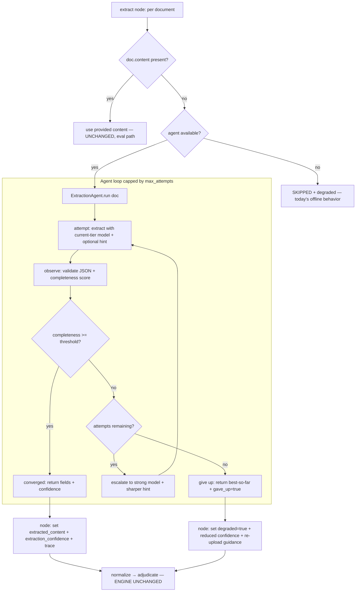

# feat: Extraction self-correction agent (perception layer)

## Summary

Add a self-correcting **extraction agent** that runs only on the live LLM/upload path: when a document read comes back low-confidence or missing key fields, it re-prompts with a sharper, field-targeted instruction and escalates from a cheap baseline model to the stronger model, looping to a capped budget before falling back to the existing degrade-and-flag-for-re-upload behavior. The deterministic decision path and the injected-content eval are untouched by design. A small explanation-consistency guard is included to close a related AI-integration gap.

---

## Problem Frame

Today the live extraction path (`app/graph/nodes/extract.py` → `llm.extract_document(doc)`) reads each document **once**. If the vision model returns a weak or incomplete result on a hard document (handwriting, stamps, phone photos — exactly the cases the assignment stresses), the system's only response is to lower the composed confidence and, below 0.50, route to manual review or ask for a re-upload. It never tries a smarter second pass. The low-level retry in `app/llm/client.py` (`_create`) only catches transient network/API errors, not poor reads. Net effect: a hard-but-readable document gets one shot, and a human inherits anything the first shot fumbles — the opposite of the "scale without linearly scaling ops" goal.

Separately, the member-facing explanation (`app/graph/nodes/explain.py`) returns the LLM's text **verbatim** when the model succeeds, with no check that the prose matches the deterministic decision's numbers. The docstring claims it "never changes the numbers," but nothing enforces it.

---

## Requirements

- R1. On the live LLM path, a low-confidence or field-incomplete extraction triggers a bounded self-correction loop (re-prompt → escalate model → converge or give up) instead of being accepted as-is.
- R2. The loop uses tiered models: a cheap baseline first, escalating to the stronger model on retry.
- R3. Give-up (budget exhausted, still weak) reuses the existing graceful-degradation mechanism — `degraded=True`, reduced confidence, re-upload guidance — never a crash.
- R4. The agent's attempts (model used, observed completeness, decision) are visible in the trace for observability.
- R5. The deterministic decision engine, the injected-content (`doc.content`) path, and the 12/12 eval are unchanged. Eval stays deterministic and offline.
- R6. The agent is behind config (enable flag, trigger threshold, attempt budget, model tiers); disabling it reproduces today's exact single-shot behavior.
- R7. The member explanation is verified against the decision's approved amount; on mismatch it falls back to the deterministic template.
- R8. Every new component has tests driven by a fake client (no network), consistent with the existing AI-seam tests.

---

## Scope Boundaries

- No changes to the rule engine (`app/rules/`), the decision precedence, or the financial math.
- No changes to the injected-content extraction path or `test_cases.json` handling.
- No async/queue/database work, and no policy-gap work (sub-limit `max()` semantics, branded-drug co-pay, per-category annual tracking, etc.).
- Not the supervisor / multi-specialist-agent refactor ("Build C").
- No new labeled document benchmark — uplift is demonstrated qualitatively on a real upload, not quantified.

### Deferred to Follow-Up Work

- **Classification self-correction**: applying the same loop to the `classify` step (the other real-upload weakness — wrong-document detection depends on a single vision call). The agent in U3 is to be designed generically enough that a `ClassificationAgent` is a thin reuse later. Deferred to a follow-up PR to keep this change atomic.

---

## Context & Research

### Relevant Code and Patterns

- `app/graph/nodes/extract.py` — the node to wire into; today loops documents and calls `llm.extract_document(doc)` on the no-content path, sets `extracted_content` / `extraction_confidence` / `degraded` / `trace`. The `simulate_component_failure` short-circuit (TC011) lives at the top and must stay.
- `app/llm/client.py` — `LLMClient` ABC + `AnthropicLLMClient`. `extract_document` validates JSON into `ExtractedDocument` (`app/models/extraction.py`) before returning `model_dump()`. `_ask`/`_create` use a single `self._model`; `_create` already has a transient retry. This is the seam to extend with a per-call model override + prompt hint.
- `app/models/extraction.py` — `extraction_completeness(fields)` returns a 0/0.33/0.67/1.0 quality proxy from three generic signals (identity, date, substantive content). This is the trigger signal — reuse it; do **not** introduce per-document-type required-field tables (that risks both scope creep and a hardcoding critique).
- `app/llm/prompts.py` — `EXTRACTION_PROMPT`; add a retry-hint constant here.
- `app/config.py` — `Settings` (pydantic-settings singleton via `get_settings()`); currently has `llm_model`, `use_llm`, `llm_timeout_seconds`, `llm_max_attempts`. Add the agent config here.
- `app/graph/builder.py` — binds `policy`/`llm` into nodes via `functools.partial`; `build_graph(policy, llm)` is the construction point and the natural place to build the agent and bind it into `extract`.
- `tests/test_llm_nodes.py` — `FakeLLM(LLMClient)` pattern (no network); the model for the agent's unit tests. `tests/helpers.py` loads the real `test_cases.json`. `tests/test_eval_all_cases.py` is the determinism guard.

### Institutional Learnings

- None on disk (`docs/solutions/` does not exist in this repo).

### External References

- Model IDs (from environment context): cheap baseline `claude-haiku-4-5-20251001`; current/strong `claude-sonnet-4-6`. No external research needed — this is the Anthropic Messages + vision API the codebase already uses.

---

## Key Technical Decisions

- **Agent runs on the LLM path only; inline-content path is byte-for-byte unchanged.** This is the load-bearing invariant: the 12 test cases carry inline `content`, so the agent never fires on them and the eval stays deterministic (R5).
- **Tiered models, escalate on retry.** Attempt 1 uses the fast model (`llm_model_fast`, default Haiku); retries use the strong model (`llm_model`, default Sonnet) plus a sharper prompt. Buys the cost/scaling story without sacrificing accuracy on hard reads (R2).
- **Trigger on `extraction_completeness` below a threshold, using its existing generic signals.** No per-doc-type field schema, no policy values — keeps the "no hardcoded policy" property intact (R1).
- **Give-up = today's degrade path.** The agent returns best-effort fields + a `gave_up` flag; the node maps that to the existing `degraded=True` + trace, so the engine and confidence formula are untouched (R3, R5).
- **Engine untouched.** The agent only changes the *values* of `extracted_content` / `extraction_confidence` / `degraded` flowing out of the extract node. `app/rules/` is not modified.
- **Explicit config object, constructed in `build_graph`.** The agent takes an `ExtractionAgentConfig` (mapped from `Settings`), constructed once in `build_graph` and bound into the node — so tests inject a config without env mangling (R6, R8).
- **Disabled flag reproduces today exactly.** Disabled → `max_attempts=1` and baseline model = `llm_model` (Sonnet), i.e., the current single-shot behavior, so the change is safely reversible (R6).
- **Explanation guard is independent and conservative.** Verify the approved-amount figure appears in the LLM text for APPROVED/PARTIAL; on mismatch use the deterministic template. Do not over-trigger on REJECTED/MANUAL_REVIEW (amount 0) (R7).

---

## Open Questions

### Resolved During Planning

- **Tiering vs. single escalation?** Resolved: tiered (Haiku baseline → Sonnet). Stronger design and supports the scaling narrative.
- **Include classification self-correction now?** Resolved: no — extraction only, design for reuse, defer classification (keeps the PR atomic).
- **Include the explanation guard?** Resolved: yes — small, squarely under AI Integration, closes a real correctness gap.
- **How does the node get config without a signature churn?** Resolved: build the agent in `build_graph` from `Settings` and bind it into `extract` (replacing the raw `llm` binding).

### Deferred to Implementation

- **Exact default threshold and attempt budget.** Start with `extraction_confidence_threshold = 0.67` (retry when fewer than ~2 of 3 signals present) and `extraction_max_attempts = 3`; tune during implementation against the sample documents.
- **Retry-hint wording.** Final phrasing of the sharper prompt tuned during implementation; it names the generic missing buckets (identity / date / amounts-or-content) from the completeness signals.
- **Whether `build_graph` reads `settings` via a new parameter or `get_settings()`.** Prefer threading `settings` in; fall back to `get_settings()` if the call site makes a parameter awkward. Settled when touching `app/main.py`.

---

## High-Level Technical Design

> *This illustrates the intended approach and is directional guidance for review, not implementation specification. The implementing agent should treat it as context, not code to reproduce.*

The agent is a perception component. Cognition (`app/rules/`) consumes the same state keys it does today; only their quality changes.

---

## Implementation Units

### U1. Extraction-agent configuration

**Goal:** Add typed config for the agent: enable flag, trigger threshold, attempt budget, and the fast/strong model tiers.

**Requirements:** R2, R6

**Dependencies:** None

**Files:**
- Modify: `app/config.py`
- Test: `tests/test_config.py`

**Approach:**
- Add to `Settings`: `extraction_agent_enabled: bool = True`, `extraction_confidence_threshold: float = 0.67`, `extraction_max_attempts: int = 3`, `llm_model_fast: str = "claude-haiku-4-5-20251001"`. Keep existing `llm_model` as the strong/escalation tier.
- These are the only new env-configurable knobs; document them in U6.

**Patterns to follow:**
- Existing `Settings` fields and `get_settings()` lru_cache singleton in `app/config.py`.

**Test scenarios:**
- Happy path: defaults load with expected values (`extraction_agent_enabled is True`, threshold `0.67`, `max_attempts 3`, `llm_model_fast` set).
- Edge case: env override of `EXTRACTION_MAX_ATTEMPTS` / `EXTRACTION_AGENT_ENABLED` is read and coerced (mirror existing config override test style; `get_settings.cache_clear()` first).

**Verification:**
- Config loads cleanly; existing `tests/test_config.py` plus the new assertions pass.

---

### U2. LLM client: per-call model override + retry hint

**Goal:** Let a caller request extraction with a specific model and an appended prompt hint, without breaking the existing single-arg call.

**Requirements:** R1, R2

**Dependencies:** None

**Files:**
- Modify: `app/llm/client.py`
- Modify: `app/llm/prompts.py`
- Test: `tests/test_llm_nodes.py`

**Approach:**
- Extend `LLMClient.extract_document` and `AnthropicLLMClient.extract_document` to `extract_document(document, *, model=None, prompt_hint=None)`. `model` overrides `self._model` for that call; `prompt_hint` is appended to `EXTRACTION_PROMPT`. Thread an optional `model` through `_ask`/`_create` (default to `self._model`). Fully backward compatible.
- Add `EXTRACTION_RETRY_HINT` to `app/llm/prompts.py` — a sharper instruction naming the generic missing buckets, formatted by the agent.

**Patterns to follow:**
- Existing `_ask`/`_create`/`_parse_json_object` flow and the `monkeypatch.setattr(client, "_ask", ...)` test style in `tests/test_llm_nodes.py`.

**Test scenarios:**
- Happy path: `extract_document(doc, model="X")` calls the API with model `"X"` (monkeypatch `_create`, assert the `model` kwarg).
- Happy path: `prompt_hint="..."` reaches the prompt text passed to `_ask`.
- Edge case (backward compat): `extract_document(doc)` with no kwargs behaves exactly as before — the two existing client validation tests (`...validates_and_coerces_llm_json`, `...raises_on_bad_schema`) still pass.

**Verification:**
- New client tests pass; all pre-existing `tests/test_llm_nodes.py` tests still pass unchanged.

---

### U3. ExtractionAgent component

**Goal:** The self-correction loop: extract → observe completeness → converge, escalate, or give up within budget.

**Requirements:** R1, R2, R3, R4, R8

**Dependencies:** U1, U2

**Files:**
- Create: `app/agents/__init__.py`
- Create: `app/agents/extraction_agent.py`
- Test: `tests/test_extraction_agent.py`

**Approach:**
- `ExtractionAgent(llm: LLMClient, config: ExtractionAgentConfig)` with a `run(document) -> ExtractionAgentResult`. Result carries `fields`, `confidence` (final completeness), `gave_up: bool`, and `attempts: list[...]` (model used, completeness, outcome) for the trace.
- Loop: attempt 1 uses `llm_model_fast`; on completeness `< threshold` and attempts remaining, escalate to `llm_model` (strong) with `EXTRACTION_RETRY_HINT` naming the missing buckets (derived from the `extraction_completeness` signals). An attempt that raises `LLMError` counts as a failed attempt; if a later attempt succeeds, converge; if none do, `gave_up=True` with best-so-far fields.
- Keep the loop model-generic (no extraction-only assumptions baked into the control flow) so a future `ClassificationAgent` can reuse the pattern.
- Define `ExtractionAgentConfig` here (small frozen model) and a `from_settings(settings)` constructor mapping `Settings` → config.

**Technical design:** *(directional — see the High-Level flowchart for the loop shape.)*

**Patterns to follow:**
- `FakeLLM(LLMClient)` from `tests/test_llm_nodes.py` for tests; `extraction_completeness` from `app/models/extraction.py`.

**Test scenarios:**
- Happy path: first read returns full fields (completeness 1.0) → converged, 1 attempt, fast model only, `gave_up is False`.
- Edge case (escalation): first read weak (e.g., completeness 0.33), second read full → converged after 2 attempts; `attempts` shows the second used the strong model; final confidence reflects the better read.
- Error path (give-up): every attempt stays below threshold → loop stops at `max_attempts`, returns best-so-far, `gave_up is True`.
- Error path (LLMError then success): attempt 1 raises `LLMError`, attempt 2 succeeds → converged; the failed attempt is recorded.
- Error path (all LLMError): every attempt raises → `gave_up is True`, no crash.
- Edge case (disabled): config with `max_attempts=1` and baseline=strong model → exactly one call, no escalation (reproduces today's single shot).
- Integration: a fake client that records per-call models proves attempt 1 = fast, attempt 2 = strong (escalation wiring is real, not assumed).

**Verification:**
- `tests/test_extraction_agent.py` covers converge / escalate / give-up / error / disabled; all pass with no network.

---

### U4. Wire the agent into the extract node and graph

**Goal:** Use the agent on the live path while leaving the inline-content and offline paths exactly as they are.

**Requirements:** R1, R3, R4, R5, R6

**Dependencies:** U3

**Files:**
- Modify: `app/graph/nodes/extract.py`
- Modify: `app/graph/builder.py`
- Modify: `app/main.py`
- Test: `tests/test_llm_nodes.py`
- Test: `tests/test_eval_all_cases.py` (verification only — must stay green, no edits expected)

**Approach:**
- Change the node to receive an `agent: ExtractionAgent | None` (built in `build_graph`) instead of the raw `llm`. Keep the `simulate_component_failure` short-circuit and the `doc.content` branch byte-for-byte. No-content + agent → `agent.run(doc)`; map result to `extracted_content`, `extraction_confidence`, and (on `gave_up`) `degraded=True`; append per-attempt trace entries (R4). Agent `None` (no llm) → today's SKIPPED degrade.
- In `build_graph(policy, llm, settings=None)`, build the agent when `llm` is present (always — the `enabled`/`max_attempts` config governs behavior), bind via `partial(extract, agent=...)`. Thread `settings` from `app/main.py`'s lifespan (or `get_settings()` fallback).

**Execution note:** Add the inline-content determinism test (below) first — it is the guardrail for the whole change.

**Patterns to follow:**
- Existing `partial(...)` binding in `app/graph/builder.py`; existing extract-node trace-entry construction.

**Test scenarios:**
- Happy path (determinism guard): a document with inline `content` is used as-is — the agent is **not** called, output identical to today.
- Happy path: no-content + agent → `extracted_content` and `extraction_confidence` come from the agent result.
- Error path: agent `gave_up` → `degraded is True` with a re-upload/failed trace note.
- Error path: agent `None` (offline) → `degraded is True`, SKIPPED trace (unchanged behavior).
- Edge case: `simulate_component_failure=True` still short-circuits to degraded without invoking the agent.
- Integration: full 12-case run through `tests/test_eval_all_cases.py` still matches every expected outcome and `system_must` (12/12, deterministic).

**Verification:**
- `python scripts/run_eval.py` reports 12/12; `python -m pytest -q` all green; inline-content path provably bypasses the agent.

---

### U5. Explanation–decision consistency guard

**Goal:** Don't ship an LLM explanation that contradicts the decision's numbers; fall back to the deterministic template on mismatch.

**Requirements:** R7, R8

**Dependencies:** None

**Files:**
- Modify: `app/graph/nodes/explain.py`
- Test: `tests/test_llm_nodes.py`

**Approach:**
- After `llm.generate_explanation(...)` returns, for APPROVED/PARTIAL verify the formatted approved-amount figure appears in the text; if not, use `_build_explanation_text(result)` instead and record a trace note (`source="template-guarded"`). Conservative: do not trigger on REJECTED/MANUAL_REVIEW (amount 0). Existing failure→template behavior is unchanged.

**Patterns to follow:**
- Existing `explain` node structure and `_build_explanation_text`; existing explain tests in `tests/test_llm_nodes.py`.

**Test scenarios:**
- Happy path: LLM text contains the correct approved amount → AI text is used.
- Error path (drift): LLM returns text with a wrong/absent amount on an APPROVED claim → output falls back to the template (correct number present); trace records the guard fired.
- Edge case: REJECTED/MANUAL_REVIEW with valid LLM text → guard does not spuriously override it.
- Regression: existing `test_explain_prefers_ai`, `test_explain_falls_back_to_built_text_on_failure`, and the degraded-caveat test still pass.

**Verification:**
- New guard tests pass; existing explain tests unchanged and green.

---

### U6. Documentation

**Goal:** Document the agent as the genuine agentic component and update the contracts/config references; correct the stale test count.

**Requirements:** R4, R6

**Dependencies:** U4, U5

**Files:**
- Modify: `docs/architecture.md` (new subsection on the agentic perception layer + the loop diagram; note it does not touch cognition)
- Modify: `docs/TECHNICAL_DOCUMENTATION.md` (component contract for `ExtractionAgent`; config reference for the new settings)
- Modify: `README.md` (pipeline description: extraction self-corrects on the live path)
- Modify: `docs/LIVE_REVIEW_SCRIPT.md` (flip Q3 — there is now a real agent to point at; update the "failure handled" framing)

**Approach:**
- Keep the honest framing: one self-correcting agent in perception; the decision is deliberately not agentic. Correct the "67 tests" figure to the actual count after this work.

**Test scenarios:**
- Test expectation: none — documentation only. Verification is that `pytest` and `run_eval.py` still pass after the doc edits (no code touched here).

**Verification:**
- Docs describe the implemented behavior; no claim outruns the code (e.g., don't call it "multi-agent").

---

## System-Wide Impact

- **Interaction graph:** Only the `extract` node's input binding changes (`llm` → `agent`) in `app/graph/builder.py`; `app/main.py` passes `settings`. No other node signature changes.
- **Error propagation:** Agent failures stay inside the extract node and surface as today's `degraded` + trace — they never escape as a 500. The engine sees the same state keys.
- **State lifecycle risks:** None new — the agent is stateless per document; no persistence added.
- **API surface parity:** `/claims` (JSON) is unaffected (inline content). `/claims/upload` (vision) gains the self-correction behavior.
- **Integration coverage:** The 12-case eval (inline path) and a no-content agent path are both exercised; the determinism guard test proves the eval path bypasses the agent.
- **Unchanged invariants:** `app/rules/` (engine, financials, normalization), the decision precedence, the confidence formula's consumption of `extraction_confidence`/`degraded`, and `test_cases.json` handling are explicitly unchanged.

---

## Risks & Dependencies

| Risk | Mitigation |
|------|------------|
| Eval determinism breaks if the inline-content branch is touched | Keep that branch byte-for-byte; add the determinism guard test (U4) first; run the full eval in verification. |
| Extra LLM calls raise cost/latency on weak reads | Hard `max_attempts` cap + fast baseline model + threshold so most reads converge on attempt 1. |
| `claude-haiku-4-5-20251001` id wrong/unavailable in the deployment | Model tiers are config; default documented; a failed fast attempt escalates to the known-good Sonnet model anyway. |
| Agent loop runaway | Bounded by `extraction_max_attempts`; each attempt is a single call. |
| Explanation guard over-triggers and hides good AI text | Guard only checks amount presence for APPROVED/PARTIAL; REJECTED/MANUAL_REVIEW untouched; tests assert no false fallback. |
| "Agentic" overclaim in the demo | Docs (U6) state plainly: one perception agent, cognition deliberately deterministic — not a multi-agent system. |

---

## Documentation / Operational Notes

- New env knobs: `EXTRACTION_AGENT_ENABLED`, `EXTRACTION_CONFIDENCE_THRESHOLD`, `EXTRACTION_MAX_ATTEMPTS`, `LLM_MODEL_FAST`. Add to `.env.example` and the config reference. Default-on; set `EXTRACTION_AGENT_ENABLED=false` to revert to single-shot.
- No migration, no schema, no rollout gating beyond the enable flag. Offline/deterministic mode (no API key) is unaffected — the agent is never constructed without an LLM client.

---

## Sources & References

- Related code: `app/graph/nodes/extract.py`, `app/llm/client.py`, `app/models/extraction.py`, `app/graph/builder.py`, `app/config.py`, `app/graph/nodes/explain.py`
- Tests: `tests/test_llm_nodes.py`, `tests/test_extraction_agent.py` (new), `tests/test_eval_all_cases.py`
- Prior analysis: `docs/LIVE_REVIEW_SCRIPT.md` (§5 Q3, AI-integration caveats)
